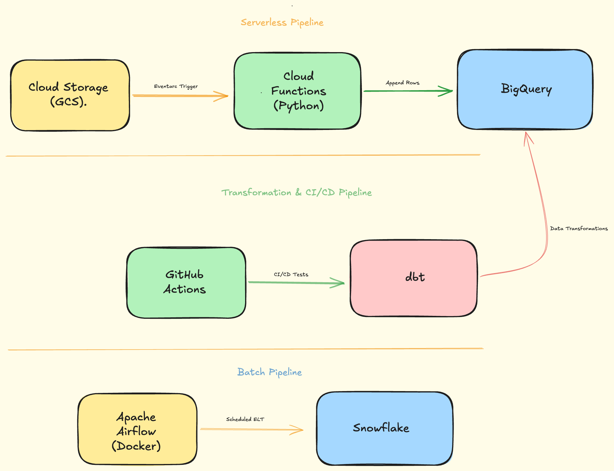

# 🚀 Enterprise Data Engineering Portfolio

A comprehensive Data Engineering portfolio demonstrating end-to-end data pipelines, modern data stack integration, and serverless cloud architecture.

This repository contains a series of progressively complex projects focusing on scalable infrastructure, automated data quality, and event-driven data ingestion.

## 🛠️ Tech Stack & Tools

---

## 🏗️ Architecture & Core Projects

Project Architecture Diagram

### 1. Serverless Event-Driven Pipeline (GCP)

Designed an event-driven architecture to ingest unpredictable data payloads with zero idle compute costs.

- **Architecture:** Google Cloud Storage $\rightarrow$ Eventarc $\rightarrow$ Cloud Functions (Gen 2) $\rightarrow$ BigQuery.
- **Highlights:** Triggered Python ingestion scripts the exact millisecond a file lands in the storage bucket, fully bypassing traditional batch-processing wait times.

### 2. CI/CD & Automated Data Quality Validation

Implemented software engineering best practices for data warehousing to ensure zero bad data reaches production.

- **Architecture:** GitHub Actions $\rightarrow$ dbt $\rightarrow$ BigQuery.
- **Highlights:** Built an automated CI/CD pipeline that spins up an Ubuntu server, securely authenticates with GCP via Service Accounts, and runs `dbt test` to validate schema constraints and data integrity on every code push.

### 3. Orchestrated ELT Pipelines (Airflow & Snowflake)

Engineered robust, scheduled batch pipelines.

- **Architecture:** Docker $\rightarrow$ Apache Airflow $\rightarrow$ Snowflake.
- **Highlights:** Containerized the Airflow environment for local development and built DAGs to automate the extraction, loading, and transformation of analytical datasets in Snowflake.

---

## ⚙️ Key Skills Demonstrated

- **Infrastructure as Code (IaC):** Deployed GCP infrastructure using the `gcloud` CLI.
- **Cloud Security:** Applied the Principle of Least Privilege using GCP IAM roles, Service Accounts, and secure secret management in GitHub Actions.
- **Data Modeling:** Designed dimensional models (Star Schema) and executed transformations using `dbt`.
- **Containerization:** Built and managed isolated execution environments using Docker.

---

## 🚀 How to Run Locally

To explore the code for specific modules, navigate to their respective directories:

1. **Airflow Orchestration:** `cd airflow_project` -> `docker-compose up -d`
2. **dbt Transformations:** `cd dbt_transformations_07` -> `dbt run`
3. **GCP Serverless:** `cd 15_gcp_serverless` -> Check `main.py` for Cloud Function logic.
